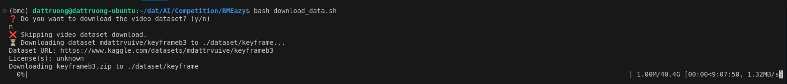
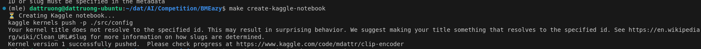
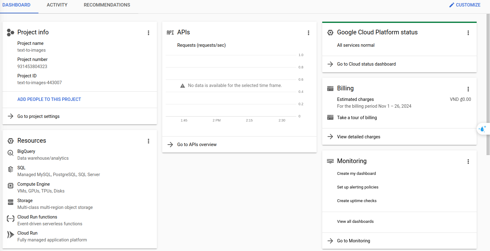
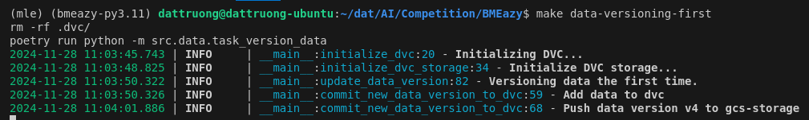

# Text to Image Retrieval

---
## **Table of Contents**

1. [Setup](#1-setup)
2. [Data preparation](#2-data-preparation)
    - [2.1 Download dataset](#21-download-dataset)
    - [2.2 Continuous Delivery (CD)](#22-continuous-delivery-cd)
    - [2.3 Continuous Deployment](#23-continuous-deployment)
    
3. [CI/CD in Machine Learning](#3-cicd-in-machine-learning)
    - [3.1 Continuous Integration (CI) in ML](#31-continuous-integration-ci-in-ml)
    - [3.2 Continuous Delivery (CD) in ML](#32-continuous-delivery-cd-in-ml)
    - [3.3 Continuous Deployment in ML](#33-continuous-deployment-in-ml)
4. [Jenkins](#4-jenkins)
5. [Future Research](#future-research)
6. [Reference](#reference)

---
## 1. Setup

## 2. Data preparation
### 2.1 Kaggle dataset
- You can get this project's dataset: [link](https://www.kaggle.com/datasets/mdattrvuive/keyframeb3/data)
- EDA or training in Kaggle notebook

### 2.2 Download dataset (Optional)
- The data of this project is very large, about ~200GiB (Keyframe dataset); if you want to extract from scratch, you can download the Video dataset (~200Gib also). But I just got 1/3 of the dataset for this demo. You can run `download_data.sh` to download the dataset.
- If you don't want to download **Video data folder**, please `n` when run bash script.
When you run `download_data.sh`: 

## 2.3 Run Clip-encoder (optional)

